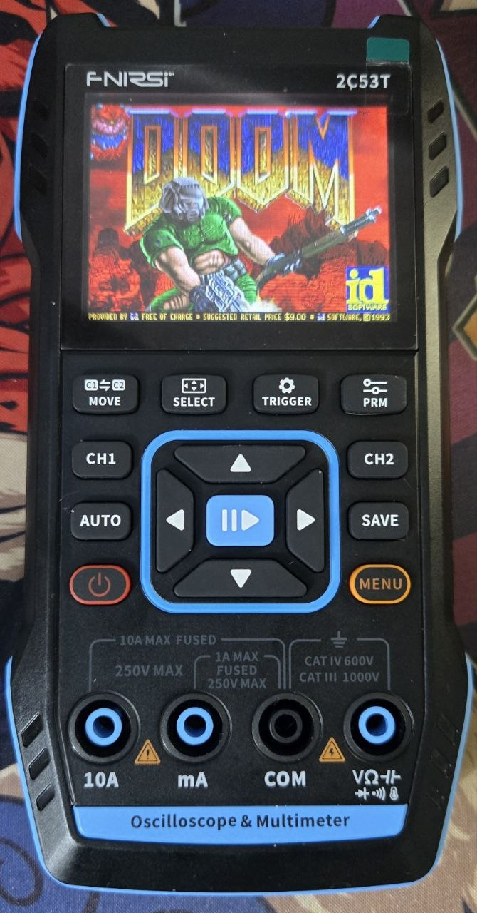

# DOOM Port for FNIRSI 2C53T Oscilloscope

This repository contains a port of the legendary game **DOOM** for the **FNIRSI 2C53T** handheld 3-in-1 instrument (oscilloscope, multimeter, waveform generator). 

This project is based on the **MG24 Doom BLE** codebase by [Nicola Wrachien (next-hack)](https://github.com/next-hack/MG24_Doom_BLE), which in turn is based on the GBA Doom Port by `doomhack` with improvements by `Kippyykip`. The code is optimized to run under tight RAM constraints and adapted for the hardware of the FNIRSI 2C53T.

<p align="center">
  
</p>

Check out other photos of the oscilloscope in the [photo/](photo/) directory.

---

## Key Features of the Port

*   **High-Quality Graphics:** The game renders at the original 320x200 resolution and is hardware-stretched to the 320x240 screen resolution (ST7789V via 16-bit parallel EXMC interface). Deep lighting (Z-depth lighting) is supported.
*   **Button Controls:** Support for all 15 physical buttons on the device (scanned at 500 Hz with hardware debouncing).
*   **Real-time OS:** Powered by FreeRTOS with separate tasks for rendering graphics and processing input.
*   **Sound System** Does not work yet.

---

## Hardware Specifications

| Component | Specification |
| :--- | :--- |
| **MCU** | Artery AT32F403A (ARM Cortex-M4F @ 240 MHz) |
| **SRAM** | 224 KB (activated via the `EOPB0 = 0xFE` configuration option) |
| **Screen** | ST7789V 320x240 RGB565 (16-bit parallel EXMC/XMC bus) |
| **Storage (SPI Flash)** | Winbond W25Q128JVSQ (16 MB). Split into Volume 0 (2 MB, official firmware resources) and Volume 1 (14 MB FAT12, starting at address `0x00200000` where the WAD file is stored) |
| **Input** | 15-button matrix keyboard |

---

## Controls on the Device

Gameplay is fully controlled via the oscilloscope keypad:

*   **Arrow Keys (`BTN_UP` / `BTN_DOWN` / `BTN_LEFT` / `BTN_RIGHT`)** — Move and turn the character.
*   **`OK` Button** — Shoot (FIRE).
*   **`MENU` Button** — Action (open doors, press buttons - USE).
*   **`AUTO` Button** — Run (SPEED/RUN).
*   **`SAVE` Button** — Bring up the DOOM game menu (MENU).
*   **`CH1` Button** — Select next weapon.
*   **`CH2` Button** — Select previous weapon.
*   **`MENU` + `POWER` Combination** — Instant reboot into DFU bootloader mode (for firmware updates).
*   **Holding `POWER` (3 seconds)** — Soft power down of the device.

---

## Loading the Game (WAD file)

To run the game, you need a game resource file — either the original `DOOM1.WAD` (Shareware version of Doom) or the full commercial version `DOOM.WAD` (renamed to `DOOM1.WAD`).

1.  Turn off the oscilloscope.
2.  Go to Settings - USB Sharing - ON.
3.  Connect the device to a computer using a USB-C cable. The computer will detect the device as a standard USB flash drive (FAT12 drive).
4.  Copy the `DOOM1.WAD` file to the root directory of the drive.
5.  Press OK to exit USB Sharing mode.
6.  Flash the custom firmware (see the "Building and Flashing" section).

*Note: If the file is not found or is corrupted, the device will display a `DOOM1.WAD NOT FOUND` error.*

---

## Building and Flashing

### System Requirements

An ARM GCC compiler and build utilities are required:
*   **Windows:** Install ARM GNU Toolchain (arm-none-eabi-gcc), `make` (via MSYS2 or WSL), and `dfu-util`.
*   **macOS / Linux:** Install `gcc-arm-none-eabi` and `dfu-util` using your package manager (apt, brew).

### Preparing Dependencies

Clone the missing external libraries inside the `firmware/` directory:

```bash
cd firmware
git clone https://github.com/ArteryTek/AT32F403A_407_Firmware_Library.git at32f403a_lib
git clone https://github.com/FreeRTOS/FreeRTOS-Kernel.git FreeRTOS
```

### Compiling

Build the firmware binary files:
```bash
cd firmware
make guest
```
After a successful build, the `firmware.bin` file will appear in the `firmware/build/` directory.

Flashing the firmware:
1.  Reboot the device into bootloader mode (`MENU` + `POWER` button combination).
2.  Upload the firmware file into the IAP section.
3.  The oscilloscope will automatically restart with the new firmware.

> [!IMPORTANT]
> *   **First Boot Note:** The very first startup after flashing might be buggy, resulting in a flashing/blinking white screen. If this happens, power cycle the device (turn it off and back on manually) and wait for the game to load. Subsequent boots will be significantly faster.
> *   **First Map Load Note:** The first time loading a map (after choosing the skill level) takes a long time (around 5 minutes). Subsequent map loads are much faster.

To revert to the official firmware, flash the APP_2C53T_V1.2.0_251015.bin file.

---

## Additional Utilities

*   `MCUDoomWadUtil` — a utility to optimize and pack WAD files (reduces RAM usage and increases load speed of lump resources). A pre-compiled version of the utility and the `mcudoom_0_4.wad` file are located in the corresponding directory.
To use it, copy your DOOM.WAD file to the MCUDoomWadUtil directory and run the command:
```
MCUDoomWadUtil.exe DOOM.WAD DOOM1.WAD
```
Copy the resulting DOOM1.WAD file to the root directory of your USB flash drive.

---

## Licenses and Acknowledgments

*   **DOOM Game Code**: Distributed under the GNU GPLv2 or later.
*   **OPL2 Emulation and Optimizations**: Nicola Wrachien ([next-hack](https://github.com/next-hack/MG24_Doom_BLE)).
*   **Hardware Drivers (Screen, Buttons, Flash)**: The [OpenScope 2C53T](https://github.com/DavidClawson/OpenScope-2C53T) project.
*   **printf Library**: Marco Paland (MIT License).
*   **Font8x8 Library**: Daniel Hepper (Public Domain).

---

## Project Status

> [!WARNING]
> This project is a proof of concept. I am unlikely to fix any bugs or maintain this repository, as there is no practical sense or purpose in doing so.
